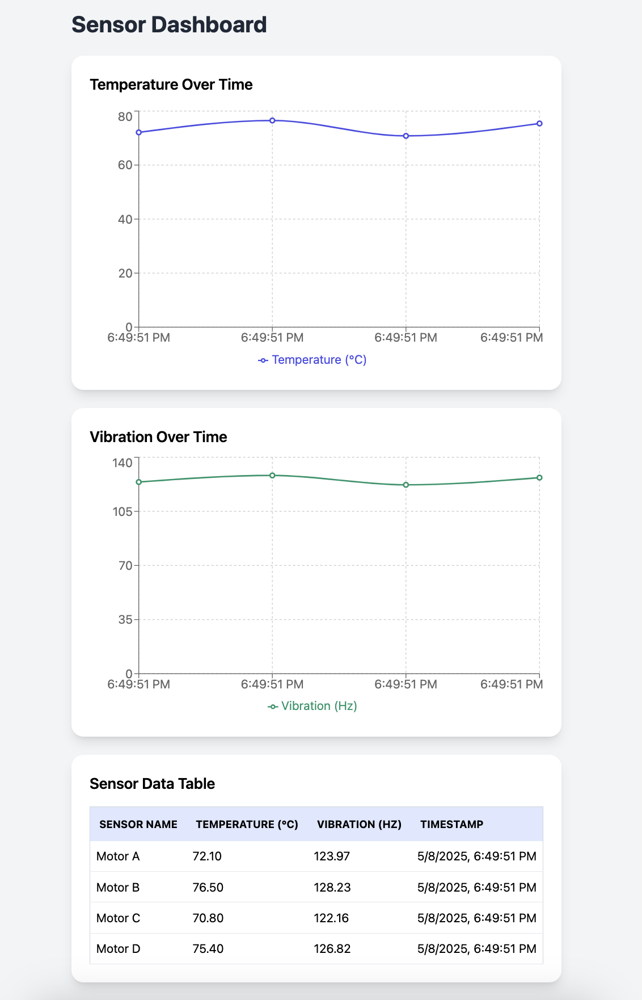
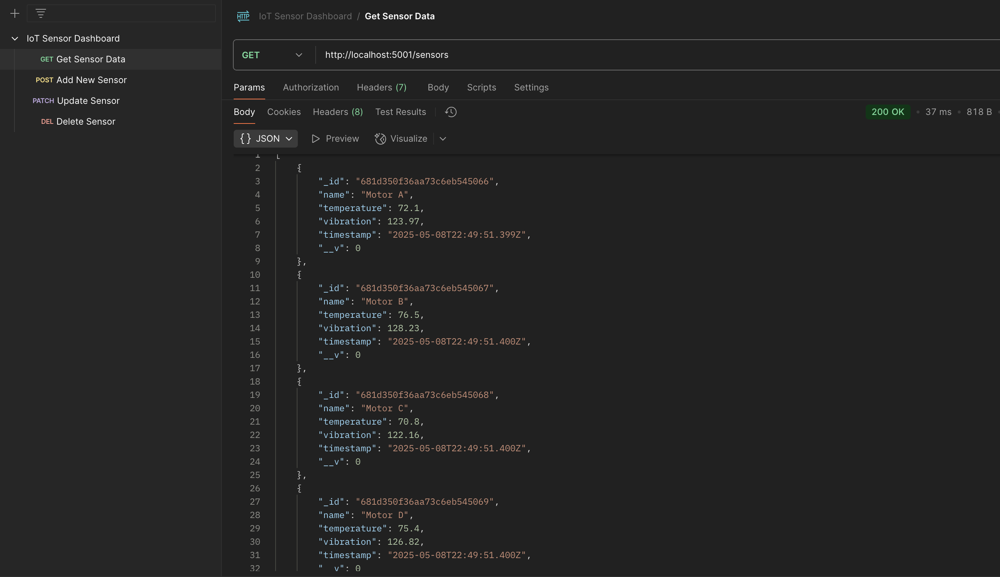

# IoT Sensor Dashboard

This is a full-stack IoT sensor dashboard that collects, stores, and displays temperature and vibration sensor data using the **MongoDB, Express, React, Node.js (MERN)** stack. The backend creates RESTful API endpoints to perform CRUD operations on the database, while the frontend displays real-time sensor data in charts and tables. This dashboard is designed to be a scalable to support a varierty of IoT applications that require sensor data monitoring and analytics.

# Key Features

- Backend built with Node.js and Express to structure API endpoints and database operations
- MongoDB used to store the sensor data
- Frontend is built with React, TypeScript, and TailwindCSS to create an interative dashboard
- Postman collection for testing the API endpoints and CRUD operations

# Screenshots

Display of temperature and vibration data fetched from MongoDB.

Sample GET request tested using Postman collection.

# Installation Instructions

# 1. Clone the Repository
git clone https://github.com/yourusername/iot-sensor-dashboard.git
cd iot-sensor-dashboard

# 2️. Set Up the Backend
cd backend
npm install  # Install dependencies
cp .env.example .env  # Configure your MongoDB URI in .env
node seed.js  # Populate database with sample data
npm start  # Start backend server at http://localhost:5000/sensors

# 3. Set Up the Frontend
cd frontend
npm install  # Install dependencies
cp .env.example .env  # Configure the API URL if needed
npm run dev # Run frontend server at http://localhost:5173

# API Endpoints

GET     `/sensors`      # Get all sensor data
POST    `/sensors`      # Add new sensor data
PATCH   `/sensors/:id`  # Update a sensor record
DELETE  `/sensors/:id`  # Delete sensor record

