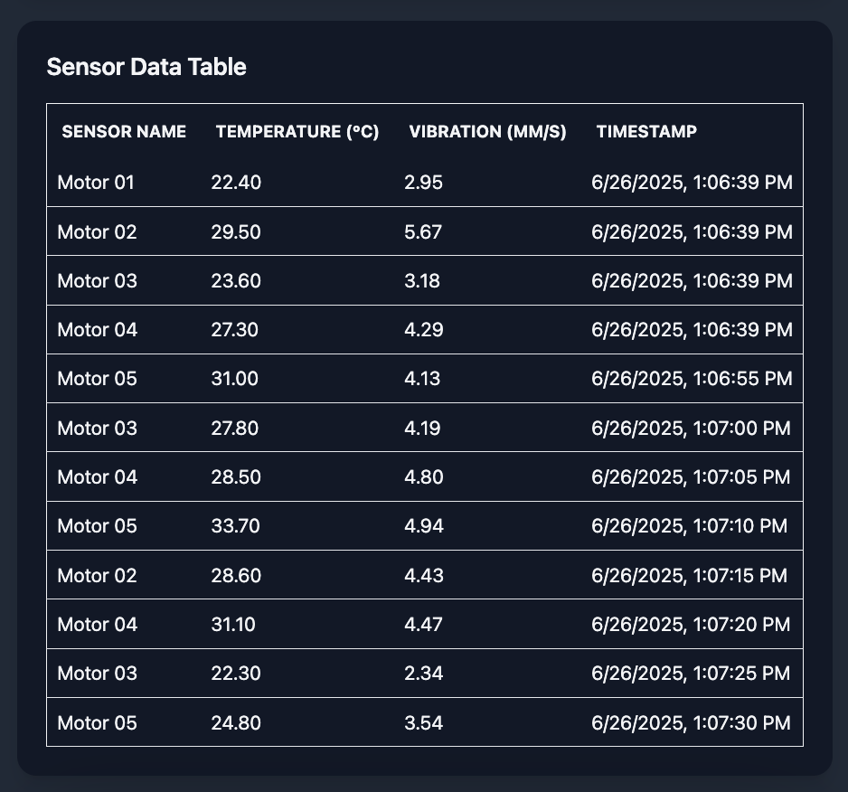

# Industrial IoT Sensor Dashboard (MERN Stack)

This is a full-stack IoT sensor dashboard that collects, stores, and displays temperature and vibration sensor data using the **MongoDB, Express, React, Node.js (MERN)** stack. The backend creates RESTful API endpoints to perform CRUD operations on the database, while the frontend displays real-time sensor data in charts and tables. This dashboard is designed to be a scalable to support a varierty of IoT applications that require sensor data monitoring and analytics.

To aid development and demonstration, the backend includes a script to populate MongoDB with sample data. Additionally, a sensor simulator script generates new data every 5 seconds. As new readings are created, the frontend dashboard automatically refreshes and displays the latest values. This simulates a real-world continuous monitoring environment typical of industrial IoT solutions.

## Key Features ##

- Backend built with Node.js and Express to structure API endpoints and database operations
- Sensor simulator script generates sample data to the API every 5 seconds
- MongoDB used to store the sensor data with timestamps
- Frontend is built with React, TypeScript, and TailwindCSS to create an interactive dashboard
- Dashboard automatically refreshes to reflect live data in real time
- Postman collection for testing the API endpoints and CRUD operations


## Screenshots ##

*Display of temperature and vibration data fetched from MongoDB while simulator is running.*


<br>
<br>


*Display of collected temperature and vibration data on the dashboard.*



<br>
<br>

*Sample GET request tested using Postman collection.*


<br>
<br>

# Installation Instructions

## 1. Clone the Repo ##

```Bash
git clone https://github.com/yourusername/iot-sensor-dashboard.git
cd iot-sensor-dashboard
```

## 2️. Set Up the Backend ##

```Bash
cd backend
npm install  # Install dependencies
cp .env.example .env  # Configure your MongoDB URI and API URL in .env
node seed.js  # Populate MongoDB with sample data
npm start  # Start backend server at http://localhost:5000/sensors
node sensorSimulator.js # Start simulator (generate data every 5 sec)
```

## 3. Set Up the Frontend ##

```Bash
cd frontend
npm install  # Install dependencies
cp .env.example .env  # Configure the API URL if needed
npm run dev # Run frontend server at http://localhost:5173
```

## API Endpoints ##

| Method | Route          | Description            |
| ------ | -------------- | ---------------------- |
| GET    | `/sensors`     | Fetch all sensor data  |
| POST   | `/sensors`     | Add new sensor data    |
| PATCH  | `/sensors/:id` | Update a sensor record |
| DELETE | `/sensors/:id` | Delete a sensor record |
